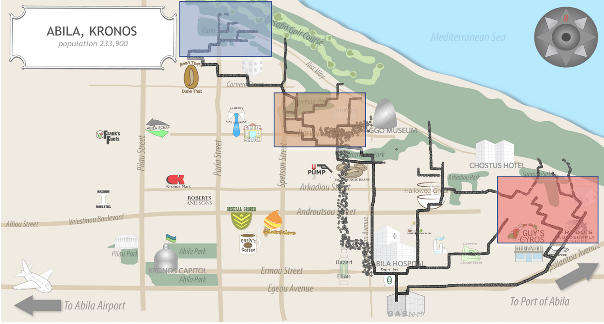
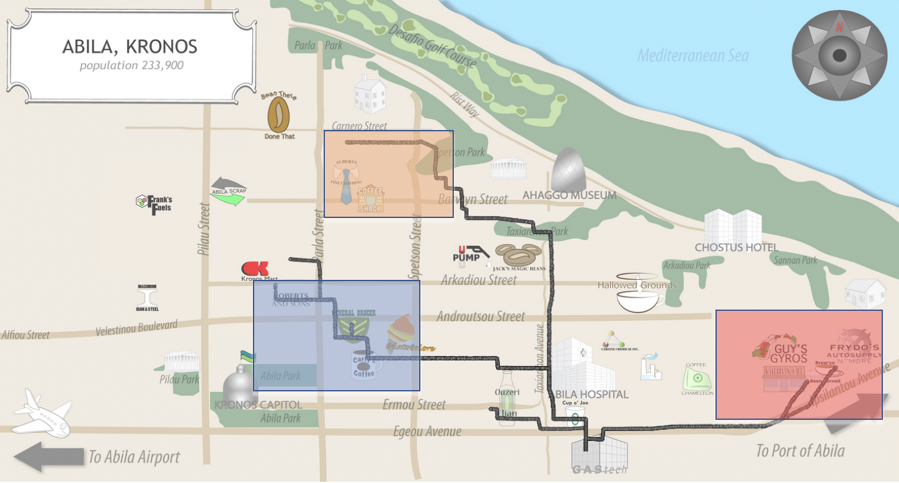
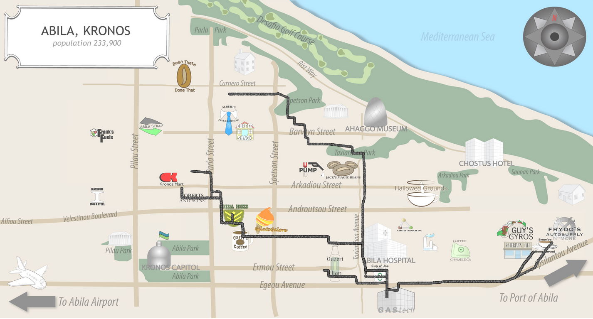
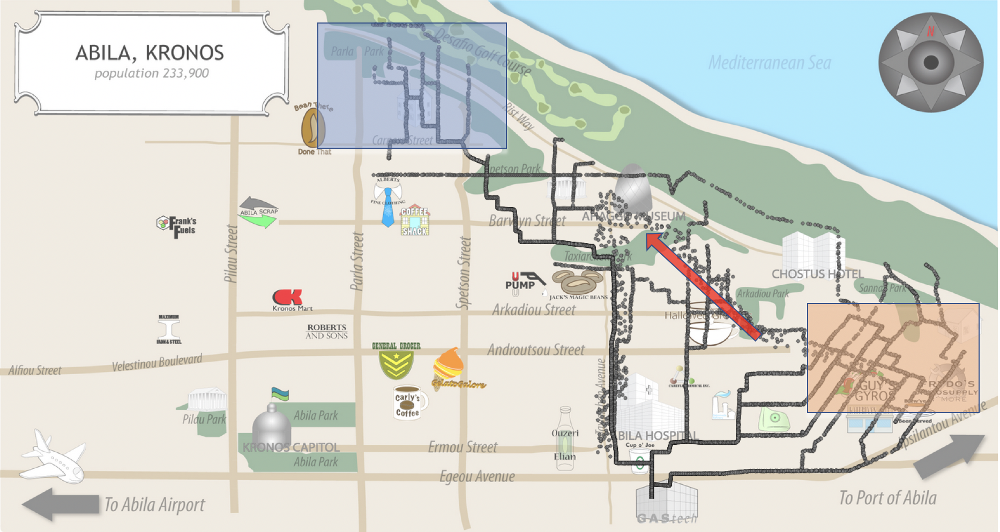
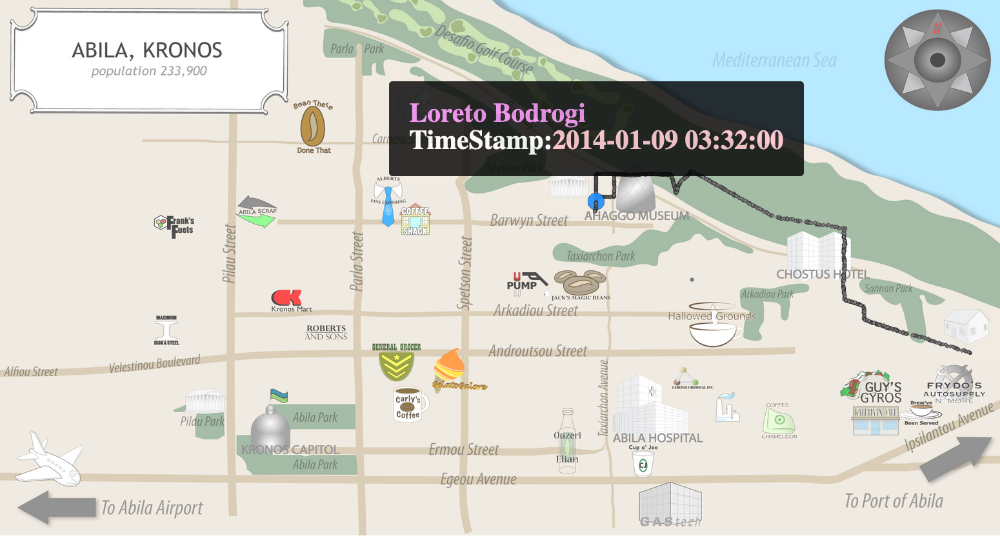
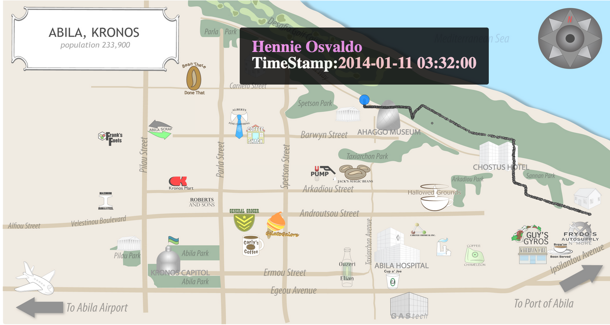
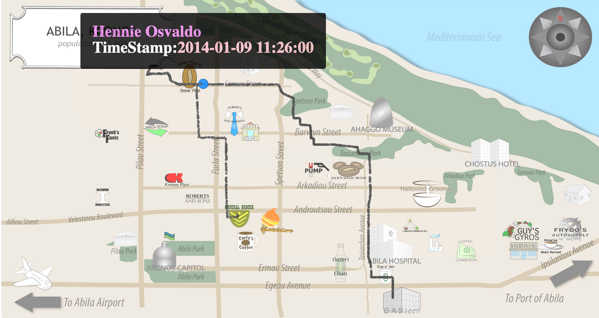
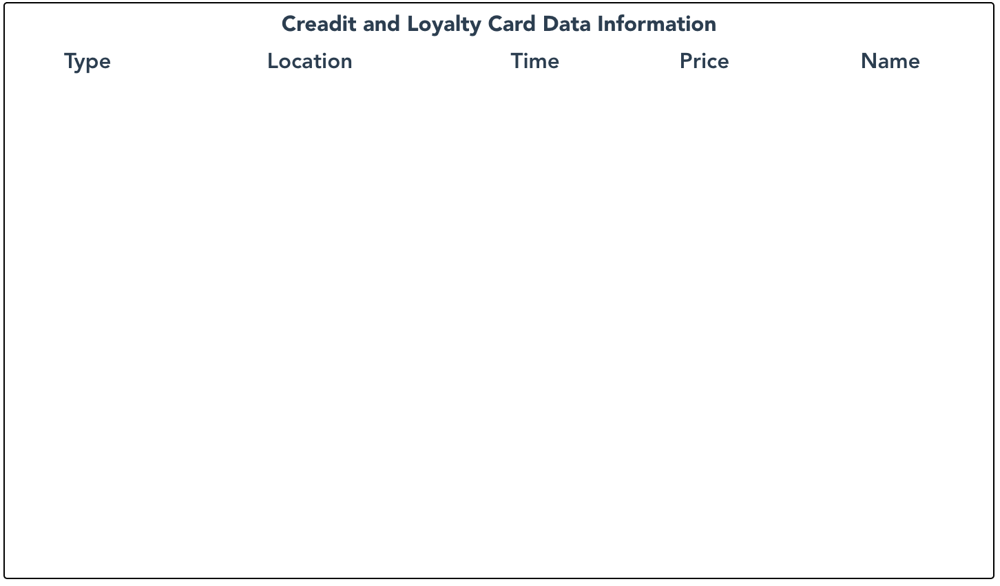
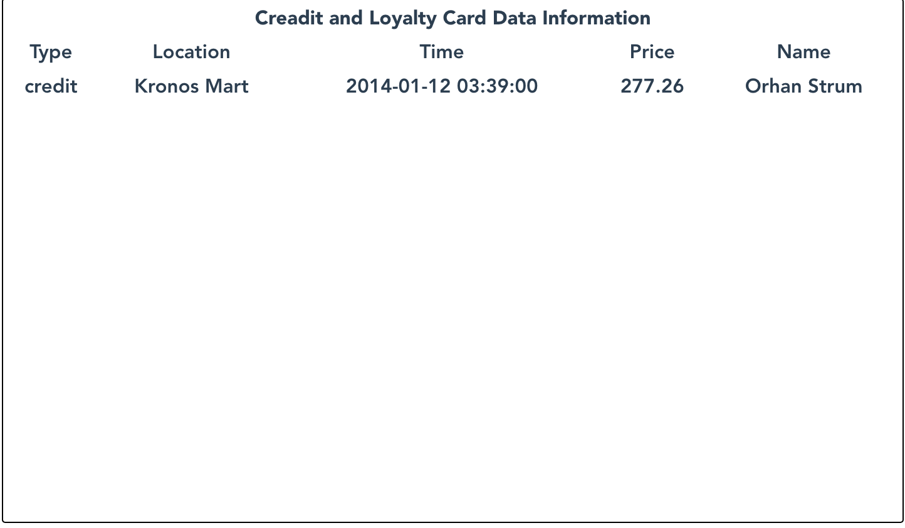
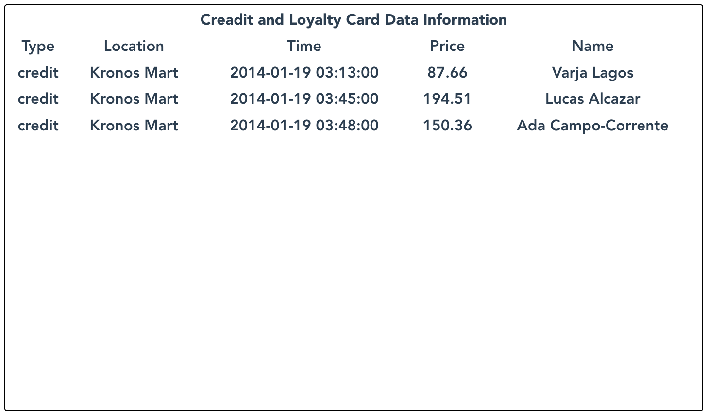

# Kronos Incident
* Group Member: Yuchen Zhou/Heming Zhang
* Alnalytic Tools: Flask; Vue; d3.js; 
* About **100** hours on development and deployment of this project
* Our Kronos-Incident Visualized Systems [Website Link](http://52.14.238.110/kronos/)
* Click [**here**](https://www.youtube.com/watch?v=NISH4pXTsuw&feature=youtu.be) to check the demo video.

## 1. Environment Setting(local machine / Remote Server)
* Local Machine: macOS Catalina 10.15.3
* Remote Server: AWS Ubuntu Server 18.04 LTS (HVM), SSD Volume Type 
* On Remote Server:
```
$ cd backend
$ python3 app.py
$ cd ../frontend
$ npm run build
$ cp -r dist /var/www/html
$ mv dist kronos
```
<!-- ## 2. Background on Protectors of Kronos -->


## 2. Problems for Patterns at GAStech

#### Questions1: Describe common daily routines for GAStech employees. What does a day in the life of a typical GAStech employee look like? Please limit your response to no more than five images and 300 words.  

* Morning:

<center>

</center>

This picture shows classical pattern of the driving paths of all employees from 7 am to 9 am. From this we can see where most employees' homes are. They are located at the north hills, northern parks and in the lower right corner. From these three places, they came to GAStech.

* Noon:

<center>

</center>

<center>

</center>

The first picture describes the driving trajectory of employees from 11:00 to 12:30 at noon. We can see that the eating places of employees are concentrated in the areas colored on the map. And second picture show that they will come back again from those areas from 12:30 to 14:00.


* Afternoon:

<center>

</center>

This picture describes the driving trajectory of employees returning home from 17:00 to 19:30. The marked area shown in the figure exactly coincides with the area where they start from in the morning, which confirms the living location of the employees. Besides that, some employee will choose to go to lower right corner to eat first, then come home.

* Night:

After 22:00, most of employee will stay at home, unless there are some special local events.


#### Questions (2) Identify up to three unusual events or patterns that you see in the data. If you identify more than twelve patterns during your analysis, focus your answer on the patterns you consider to be most important for further investigation to help find the missing staff members. For each pattern or event that you identify, provide a supporting image and describe:

#### 1st Pattern: Unusual Meetings at Nights

<center>

</center>

<center>

</center>

* Location and Time: In 1/9, 1/11, 1/14 nights from 3:00 - 5:00, we find out that some invalid tracks for people. They drived trucks from lower right corner resident area to the **northern park**.

* People Involved: Those events involved **Loreto Bodrogi, Minke Mies, Hennie Osvaldo, Isia Vann**, which convinced our analysis on the employee emails at 1st questions that those four are a group and always send emails among them.

* Reason: Usually, people will not go outside in those time, and they came to the same locations frequently at werid timestamp which made them suspcious.

* Level of Confidence: We can say that this actions are really werid and we are confident about this. Hence, we should take these people as a breakthrough for the next phase of the task.

#### 2nd Pattern: Unusual Activities at Noon

<center>

</center>

<center>

</center>

* Location, Time and People Involved: In 1/9 from 11:00 - 13:30, we find a invalid track for Hennie Osvaldo. He stayed around **Bean There Done That** for about half an hour.

* Reason: 
    * He drove a long distance away from the company at noon, but there was no record of consumption, indicating that he did not go out for lunch. It was very suspicious to drive out so far at lunchtime.
    * Usually, people will choose to have lunch at those places analysed in 1st question, but he was not in there.

* Level of Confidence: We are at medium level confidence about this activity, since we have no solid evidence, like meeting with someone, to support this. Maybe he had an emergency errand to deal with.


#### 3rd Pattern: Unusual Consumption at Nights

<center>

</center>

<center>

</center>

* Location and Time: In 1/12, 1/19 nights from 3:00 - 4:00, we find that some unusual consumption records at **Kronos Mart**.

* People Involved: These events involved **Orhan Strum, Varja Lagos, Lucas Alcazar, Ada Campo-Corrente**.


* Reason: There are generally no shops open late at night, but this mall is still open late at night, and several corporate customers have very close consumption records, which is very suspicious.

* Level of Confidence: We are not very sure about this, since we have no idea about what goods they bought and relationship between the customs and owner of the Mart.

